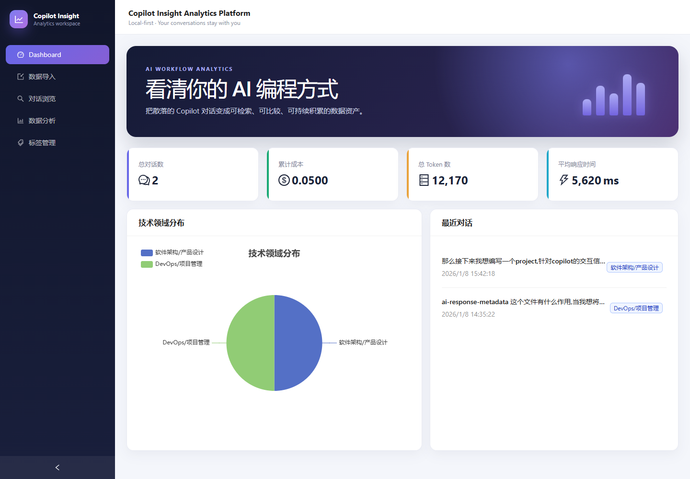

<div align="center">

# Copilot Insight Analytics Platform

**把 GitHub Copilot 对话变成可检索、可比较、可持续积累的数据资产。**

[English](README_EN.md) · [快速开始](QUICK_START.md) · [开发指南](docs/DEVELOPMENT.md)

[](https://github.com/lzx-Bill/copilot-insight-analytics-platform/actions/workflows/ci.yml)
[](LICENSE)
[](backend/requirements.txt)
[](frontend/package.json)

</div>



## 为什么做这个项目？

Copilot 对话通常在任务结束后就被遗忘。CIAP 将它们解析为结构化数据，让你可以：

- 发现高频技术领域、问题类型和模型使用习惯。
- 跟踪 Token、预估成本、响应时间及工具调用趋势。
- 搜索、归类和回顾过去的技术问题与回答。
- 将数据保存在自己的 MongoDB 中，本地优先，不上传第三方分析服务。

> 当前 Token、成本和响应时间来自 Copilot 输出的元数据，属于估算值，不代表 GitHub 官方计费或真实遥测。

## 现有能力

| 能力 | 说明 |
|---|---|
| 对话导入 | 粘贴文本或批量上传 `.md` / `.txt` 文件 |
| 智能解析 | 提取问题、回答、时间、模型、Token、成本和工具信息 |
| 数据看板 | KPI、领域、项目、模型、意图、趋势和工具使用分析 |
| 对话管理 | 搜索、筛选、编辑、收藏、删除和分页浏览 |
| 标签归类 | 将多个原始领域、项目或意图合并为统一标签 |
| 本地部署 | React + FastAPI + MongoDB，Docker Compose 启动 |

## 3 分钟开始

### Windows 一键启动

```powershell
git clone https://github.com/lzx-Bill/copilot-insight-analytics-platform.git
cd copilot-insight-analytics-platform
Copy-Item .env.example .env
.\start.ps1
```

打开：

- Web：<http://localhost:5173>
- API：<http://localhost:8847>
- Swagger：<http://localhost:8847/docs>

停止或查看状态：

```powershell
.\status.ps1
.\stop.ps1
```

### Docker Compose 开发环境

```bash
cp .env.example .env
docker compose up -d --build
```

当前 Compose 使用 Vite 开发服务器和 Uvicorn reload，适合本地体验与开发，不是生产部署模板。

## 数据如何进入 CIAP？

```text
Copilot 回答附加 YAML 元数据
              ↓
复制文本或导出 Markdown
              ↓
CIAP 解析并写入 MongoDB
              ↓
Dashboard / Analytics / Search
```

1. 将 [.github/copilot-instructions.md](.github/copilot-instructions.md#必须执行的响应元数据追加) 中的“响应元数据追加”部分复制到你的项目。
2. 正常使用 GitHub Copilot。
3. 把包含 `User:`、`GitHub Copilot:` 和 YAML 元数据的内容粘贴或上传到 CIAP。

最小格式：

````markdown
User: 如何优化这个查询？

GitHub Copilot: 可以先检查执行计划……

```yaml
---
session_id: demo-session
question_id: demo-question-001
timestamp: 2026-01-08T14:30:00+08:00
project_name: my-project
domain: Database
model: Claude Sonnet 4.5
tokens_input: 1200
tokens_output: 500
estimated_cost: 0.01
---
```
````

## 技术栈

- 前端：React 18、TypeScript、Vite、Ant Design、ECharts、TanStack Query
- 后端：FastAPI、Beanie、Motor、PyYAML
- 数据：MongoDB 7；Redis 已预留但当前核心流程不依赖缓存
- 工具：Docker Compose、pytest、ESLint

## 本地验证

```powershell
cd backend
..\.venv\Scripts\python.exe -m pytest -q

cd ..\frontend
npm run lint
npm run build
```

## 路线图

- [x] 文本与批量文件导入
- [x] 对话 CRUD、筛选、统计与标签归类
- [x] 响应式 Dashboard 和分析页面
- [ ] 导入前解析预览与字段修正
- [ ] JSON / CSV / Markdown 导出
- [ ] 真实遥测适配器，减少模型自报数据误差
- [ ] 面向外部部署的认证和生产镜像

欢迎提交 Issue 和 Pull Request。若你想参与，优先从解析格式兼容、导出能力或文档示例开始。

## License

[MIT](LICENSE)
